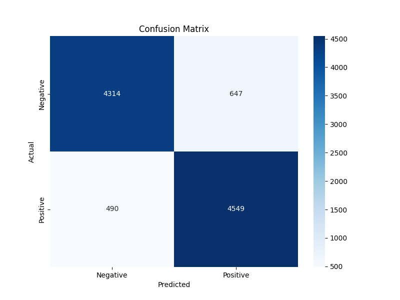

# Movie Review Sentiment Analysis

A sentiment analysis application that classifies movie reviews as positive or negative, built with Python, scikit-learn, and Streamlit.



## Overview

This project analyzes the sentiment of movie reviews using machine learning. It features:

- Natural Language Processing (NLP) to process text data
- A machine learning model trained on the IMDB Dataset
- A clean, user-friendly web interface for real-time analysis
- Visualizations of prediction results and model performance

## Project Structure

- `train_model.py`: Script to preprocess data, train the model, and save the model files
- `app.py`: Streamlit web application for analyzing reviews
- `requirements.txt`: Project dependencies
- `model.pkl`: Trained model file (created after running train_model.py)
- `vectorizer.pkl`: TF-IDF vectorizer for text processing
- `model_metrics.pkl`: Model performance metrics
- `IMDB Dataset.csv`: Dataset containing movie reviews and their sentiment

## Setup Instructions

### Option 1: Running Locally

1. Clone the repository:
   ```
   git clone https://github.com/yourusername/movie-review-sentiment-analysis.git
   cd movie-review-sentiment-analysis
   ```

2. Install dependencies:
   ```
   pip install -r requirements.txt
   ```

3. Train the model (if model files aren't included):
   ```
   python train_model.py
   ```

4. Run the Streamlit app:
   ```
   streamlit run app.py
   ```
   
   The application will be available at http://localhost:8501

### Option 2: Using pipx (Recommended for Debian-based systems)

1. Install pipx:
   ```
   sudo apt update
   sudo apt install pipx
   pipx ensurepath
   ```

2. Install Streamlit and dependencies:
   ```
   pipx install streamlit
   pipx inject streamlit pandas numpy scikit-learn nltk matplotlib seaborn plotly wordcloud joblib
   ```

3. Clone and run the app:
   ```
   git clone https://github.com/yourusername/movie-review-sentiment-analysis.git
   cd movie-review-sentiment-analysis
   streamlit run app.py
   ```

## How to Use

1. Enter a movie review in the text area
2. Click "Analyze Sentiment" button
3. View the sentiment prediction (positive or negative) with confidence score
4. Explore the confidence distribution and word cloud visualization
5. Check model performance metrics in the expandable section

## Model Performance

The sentiment analysis model achieves approximately 89% accuracy on the IMDB dataset. The confusion matrix and detailed metrics are available in the application's "Model Performance Metrics" section.

## Dataset

The project uses the IMDB Movie Reviews dataset, which contains 50,000 movie reviews labeled as positive or negative sentiment.

## Technologies Used

- **Python**: Programming language
- **scikit-learn**: Machine learning library
- **NLTK**: Natural Language Processing toolkit
- **Streamlit**: Web application framework
- **Matplotlib/Seaborn/Plotly**: Data visualization
- **WordCloud**: Word cloud generation

## Future Improvements

- Implement more advanced NLP techniques (e.g., BERT, transformers)
- Add support for multiple languages
- Improve visualization of feature importance
- Create a more detailed analysis of review content

## License

MIT License

## Contributors

- Your Name - Initial work

---

Feel free to open issues or contribute to this project! 